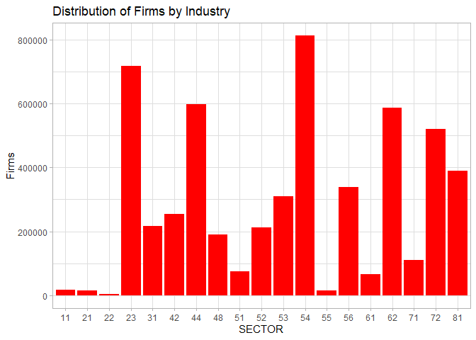
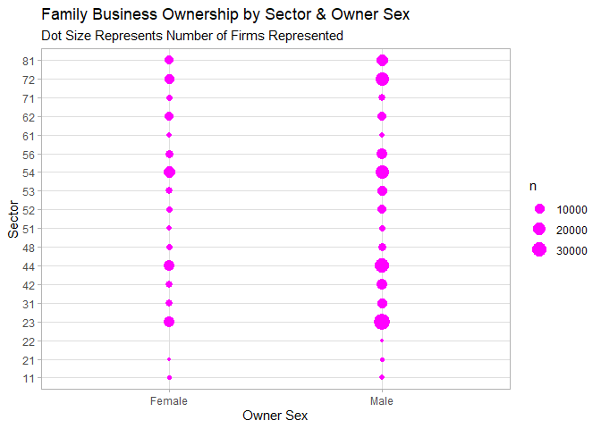

Census Bureau ABS API Vignette
================
Lisa O’Connell
2023-10-11

``` r
knitr::opts_chunk$set(echo = TRUE, message=FALSE, warning=FALSE)
```

## Introduction

Data from the American Business Survey (ABS) conducted by the US Census
Bureau is explored in this vignette. The purpose of the vignette is to
demonstrate access to multiple endpoints within the ABS data using a
several query parameters. Additionally an Exploratory Data Analysis
(EDA) is completed which includes both numeric and graphical
summarizations. This vignette was created and is shared using a GitHub
repository and GitHub page.

## Description of Data

**Endpoints Over Time**  
The American Business Survey data represents aggregated responses from
the ABS survey conducted in the prescribed year from the selected
endpoint. The purpose of the ABS surveys are to provide a profile of
businesses in America, with responses tabulated across several
classification categories.

The ABS data accessed for this vignette represents the endpoints for the
year 2021 which contains data from the 2020 survey. Data from survey
estimates for the years 2020-2018 are available.

*Endpoint Pathways:*  
Company Summary Data Link: <http://api.census.gov/data/2020/abscs>  
Characteristics of Business Data Link:- Characteristics of Business:
<https://api.census.gov/data/2020/abscb>

*Additional Endpoints Available*  
An additional endpoint is available, but is not used in this vignette:  
Characteristics of Business Owners:
<https://api.census.gov/data/2020/abscbo>  
Module Business Characteristics:
<https://api.census.gov/data/2020/absmcb>

The ABS datasets contain summarized survey data from 2020 surveys. Data
is available at the US, state and statistical area levels. This vignette
accesses data at the US level.

- Business data can be profiled using survey responses classifications
  related to the business owner including for example veteran stats,
  sex, & race.

- Quantitative variables the endpoints accessed in this vignette include
  estimated number of employees, a count of responding firms and
  estimated annual payroll expenses.

**Returned Data Format:**  
As described in the [“CENSUS Data API User
Guide”](https://www.census.gov/content/dam/Census/data/developers/api-user-guide/api-guide.pdf)
The American Business Survey data is returned through an API via a 2
dimensional JSON array formatted as shown below for 3 variables:

\[\[“EMP” ,“STATE”, “PAYANN”\]\],  
\[“10000,”GA”, “500000”\],  
\[“5000,”TX”, “650000”\]….

As a result, a general function has not used to query all
classifications in one data pull. More sophisticated programming
techniques may be able to improve the data access functions, improving
the efficiency and streamlining this code.

The ABS endpoints include records at various levels of aggregation. The
ABS data use the North American Industry Code System (NAICS2017) values,
with aggregations of data at the 4-digit, 3-digit, and 2 digit NAICS
code.

# Requirements: R Libraries

The following libraries are used to process access and process data in
R. The `tidyverse` library provides a set of packages relevant for data
tidying, wrangling, and data summarization. The `httr` package provides
functions for manipulating urls. The `jsonlite`package provides
functions transfer of json data. The `pollster` package was included to
facilitate cross tab summaries of aggregated survey data. Finally, the
`gghalves` package was included to create additional graphing styles.
Select functions from `knitr` are used to create table output.  
**Libraries:**  
`library(tidyverse)`  
`library(httr)`  
`library(jsonlite)`  
`library(pollster)`  
`library(gghalves)`

# Functions to Retrieve ABS Data

Several functions are created to facilitate data retrieval. These
functions allow query arguments to be passed in to select specific
results. Several helper functions are created to support the data
wrangling and cleaning process. Wrapper functions are created to tidy
data once received from the API call.

# Functions List

API Related Functions:  
**CS Data**  
`CSData` - A combined function to create an API path, wrangles data into
tidy tibble. Arguments allow for modification of 2 values in the
endpoint (veteran status and industry code), with a default of a
wildcard to allow it to be used as needed.

**CB Data**  
`CBPath` - Creates query path allowing four user query parameters:
NCAICS code, survey question, veteran status, and owner sex.  
`CBData` - Retrieves data from the Characteristics of Businesses
endpoint.

\_\_ Helper Functions\_\_  
`ConvertData`  
`CreateTibble`  
`Wrangle`  
`DeAggto4`

## Query parameters:

**NAICS2017-** The North American Industry Classification System (NAICS)
industry code is the primary subsetting variable for both datasets. It
is from the 2017 NAICS table. The argument for this query parameter is
labeled `industryCode=`. This value can take on any 2-4 digit
representation of the NAICS table, using a “\*” as a wildcard.

The NAICS 2017 table used is available here:
<https://www.census.gov/naics/?48967>

**VETERAN STATUS-** A categorical variable that returns the status of
the business owner as a veteran. The query parameter for this function
argument is `vets=`, and cans take on the value, of vet, nonvet, both,
all or a wildcard.

**SEX-** - A categorical variable returning the sex of the business
owner. This arguement is labeled `sx=` and can take on the value of
male, female or all.

**SURVEY QUESTIONS** Survey responses are captured in the survey
questions variables. There are several survey questions to choose from,
so it is impractical for this vignette to code user friendly
descriptions for all survey questions. A table of the survey question
codes and the answer codes can be found on the ABS website here:
<https://www.census.gov/data/developers/data-sets/abs.html>.

This vignette focuses on survey question “B02” related to businesses
being either family run or not family operated. The aruguement for this
survey question is `bizAttrib="B02"`.

## Function Definitions

**User friendly inputs for functions:**  
The following words are used as input to the functions.

`vets = "all"` both non vet and vet business owners  
`vets = "vet"` vet business owners  
`vets = "mixed"` join/not vetnvet ownership  
`vets = "nonvet "` non vet

`sx=all` male, female and equal shared ownership  
`sx=female`female owners only  
`sx=male`male owners only

*The user of these functions must know their industry code of interest
and survey question of interest.*

## Function Code

``` r
#Retrieves from the Company Summaries endpoint
#* is a wildcard value

CSData<- function(vets="all",industryCode="*") {

endpath <- "https://api.census.gov/data/2020/abscs?"

#A list of variable to return, excluding the query variables
varlist <- "get=FIRMPDEMP,PAYANN,EMP,RCPPDEMP,SECTOR,SUBSECTOR"

#Parse the user-friendly inputs

 switch(vets, 
       vet = {vtStat<-"002"},
       nonvet = {vtStat<- "004"},
       mixed = {vtStat<- "003"},
       all = {vtStat<- "002&VET_GROUP=004&VET_GROUP=003"},
      stop ("Please check your vets input - should be vet, nonvet, mixed or all")
       )

#Paste query variables to path
path <- paste0(endpath,
              varlist,
              #A list of  query arguments
              "&for=us:*",
              "&NAICS2017=", industryCode,
              "&VET_GROUP=", vtStat, 
              "&key=324a30368aa24fca02eb737c15d7c32c63c891cb")

#Execute the API call 
raw_data <- GET(path)

#Print status code of returned data
a<-status_code(raw_data)
print(a)

my_df<-raw_data %>%
     Wrangle() %>% # A wrapper function
     #Modify variable types
     mutate(Firms = as.double(FIRMPDEMP),
            Revenue = as.double(RCPPDEMP),
            Payroll = as.double(PAYANN),
            Employees = as.double(EMP)) %>% 
     mutate(Industry = as.factor(NAICS2017), 
             SECTOR=as.factor(SECTOR), 
             SUBSECTOR= as.factor(SUBSECTOR),
             VET_GROUP= as.factor(VET_GROUP))
                     
    
      
return(my_df)
}
```

``` r
#Converts raw JSON data to tibble

ConvertData<-function (my_raw) {
    a1_df<-fromJSON(rawToChar(my_raw$content))
    a2_df<-as_tibble(a1_df)
  invisible(a2_df)
}
```

``` r
#Createx tibble 

CreateTibble<-function(temp_df) {

  temp_df<-as_tibble(temp_df)

  #Get variable names from the first row of data
  var_names<-slice(temp_df,1)
  num_cols<-length(var_names)
  
  b<-pivot_longer(var_names, 
                cols=1:num_cols,
                values_to = "new_name", 
                names_to="old_name")

  #Replace variable names
  my_names<-b$new_name

  #Remove the column name header row
  colnames(temp_df)<-my_names
  new_data<-temp_df[-1, ]

  # Return data in pipe form
  invisible(new_data)
}
```

``` r
#Wrapper function for data wrangling
Wrangle<- function(my_df){

    number_vars<-c("PAYANN", "FIRMPDEMP",  "EMP")     

    tidy_data <- my_df %>% 
       ConvertData() %>% 
       CreateTibble() %>% 
       DeAggto4() %>% 
       mutate(across(number_vars, as.double)) 
   invisible(tidy_data)
}
```

``` r
#Removes aggregated records to leave only 4 digit NAICS codes.
#This is needed to remove duplicate rows reported in the raw data due to aggregation values
DeAggto4<-function (a_df) {

    a_df <- a_df %>%
        filter(((nchar(NAICS2017)) > 3) &
               ((substring(NAICS2017, 3,3)!="-")))
    invisible (a_df)
    }
```

``` r
#Creates an url path for API
# For purpose of this demonstration, a default question is set for bizAttrib.
CBPath<- function(bizAttrib="B02", bizAnswer="*", vets="all", industryCode="*", sx="all") {

  endpath <- "https://api.census.gov/data/2020/abscb?"
  varlist <- "get=QDESC_LABEL,BUSCHAR_LABEL,EMP,FIRMPDEMP,PAYANN,RCPPDEMP,SECTOR,SUBSECTOR"

   switch(vets, 
       vet = {vtStat<-"002"},
       nonvet = {vtStat<- "004"},
       mixed = {vtStat<- "003"},
       all = {vtStat<- "002&VET_GROUP=004&VET_GROUP=003"},
        stop ("Please check your vets input"))
     
   switch(sx, 
      all = {SEX <- "002&SEX=003"},
      male = {SEX <-"003"},
      female = {SEX<- "002"},
       stop ("Please check your sx input"))

  path <- paste0(endpath,varlist,
                "&for=us:*",
                "&NAICS2017=", industryCode,
                "&VET_GROUP=",vtStat,
                "&SEX=", SEX,
                "&QDESC=",bizAttrib,
                "&BUSCHAR=", bizAnswer,
                "&key=324a30368aa24fca02eb737c15d7c32c63c891cb")
return(path)
}
```

``` r
#Retrieves Characteristics of Business Data from API using the url path passed in.
CBData<- function (path) {

  rawcb <- GET(path)
   
#Print status code of returned data
   a<-status_code(rawcb)
   print(a)
  
#Tidy data
 
   my_df<-rawcb %>%
      Wrangle() %>%
       DeAggto4() %>% 
   #Modify variable types
   mutate(Firms = as.double(FIRMPDEMP),
            Revenue = as.double(RCPPDEMP),
            Payroll = as.double(PAYANN),
            Employees = as.double(EMP))     %>% 
     mutate(Industry = as.factor(NAICS2017), 
             SECTOR=as.factor(SECTOR), 
             SUBSECTOR= as.factor(SUBSECTOR),
             SEX= as.factor(SEX),
             BUSCHAR= as.factor(BUSCHAR),
             VET_GROUP= as.factor(VET_GROUP))
invisible(my_df)
  }
```

# Exploring the Company Summary Data

### RQ1 - Distribution of Firms Across Industry Sectors

The Company Summary endpoints allows us to profile businesses and
business owners.

Let’s get some data using my API functions:

``` r
CS_all<-CSData(vets = "all", industryCode = "*")
```

    ## [1] 200

``` r
#Return Status of API pull displayed - 200 is successful pull
```

Next, here is a look at the nature of the variables stored in the
dataset, to get an overview of the the returned data.

``` r
summary(CS_all)
```

    ##    FIRMPDEMP            PAYANN               EMP            RCPPDEMP             SECTOR   
    ##  Min.   :     0.0   Min.   :        0   Min.   :      0   Length:822         31     :253  
    ##  1st Qu.:     0.0   1st Qu.:        0   1st Qu.:      0   Class :character   44     : 79  
    ##  Median :   102.5   Median :   101250   Median :   2100   Mode  :character   48     : 77  
    ##  Mean   :  6627.0   Mean   :  3466582   Mean   :  75397                      42     : 57  
    ##  3rd Qu.:  2281.5   3rd Qu.:  1654831   3rd Qu.:  35186                      62     : 52  
    ##  Max.   :396226.0   Max.   :136308343   Max.   :8268436                      56     : 33  
    ##                                                                              (Other):271  
    ##    SUBSECTOR    NAICS2017         VET_GROUP      us                Firms             Revenue 
    ##  311    : 27   Length:822         002:277   Length:822         Min.   :     0.0   Min.   :0  
    ##  332    : 27   Class :character   003:264   Class :character   1st Qu.:     0.0   1st Qu.:0  
    ##  423    : 27   Mode  :character   004:281   Mode  :character   Median :   102.5   Median :0  
    ##  424    : 27                                                   Mean   :  6627.0   Mean   :0  
    ##  541    : 27                                                   3rd Qu.:  2281.5   3rd Qu.:0  
    ##  561    : 24                                                   Max.   :396226.0   Max.   :0  
    ##  (Other):663                                                                                 
    ##     Payroll            Employees          Industry  
    ##  Min.   :        0   Min.   :      0   1131   :  3  
    ##  1st Qu.:        0   1st Qu.:      0   1132   :  3  
    ##  Median :   101250   Median :   2100   1133   :  3  
    ##  Mean   :  3466582   Mean   :  75397   1142   :  3  
    ##  3rd Qu.:  1654831   3rd Qu.:  35186   1151   :  3  
    ##  Max.   :136308343   Max.   :8268436   1152   :  3  
    ##                                        (Other):804

The chart below shows the firm distribution by 2 digit NAICS sector.

``` r
#Firm Population by Sector
all_sector<-CS_all %>%
   group_by(SECTOR) %>% 
   summarize(Firms = sum(Firms))

ggplot(all_sector, aes(Firms, SECTOR)) +
  geom_col(fill= "red")+
  theme_light()+
  labs(title="Distribution of Firms by Industry ")+
  coord_flip()
```

<!-- -->

Let’s look at the the distribution of veteran owned firms. This
represents one modification to the endpoint.

### Resesarch Question 2 - Distribution of Veteran Owned Firms Across Sectors

I have chosen to access the endpoint to review business ownership by
veterans across all industry sectors.

``` r
CS_vets<-CSData(vets = "vet", industryCode = "*")
```

    ## [1] 200

``` r
#Return Status of API pis shown - 200 is successful pull
```

``` r
#Create summarized dataset 

vet_by_sector<-CS_vets %>%
   group_by(SECTOR) %>% 
   summarize(total_firms = sum(Firms, na.rm=TRUE))

#Plot of veterans by sector

ggplot(vet_by_sector,aes(total_firms, x=SECTOR)) +
  geom_col(fill="blue")+
  theme_light() +
  labs(title="Distribution of Vet Owned Firms by Industry",
       y= "Total Firms") 
```

<!-- -->

The distribution of veteran owned firms for the most part mimics the
wider distribution of firms shown in the previous plot, however some
sectors, 53 and 72 may have a different levels of ownership for vets
compared to the general population of firms. This could be further
investigated.

There are large concentrations of veterans in sector 23(Construction),
54(Scientific & Technincal Services), and 62 (Healthcare). Of course
this is consistent with the overall size of the these sectors.

### RQ3: An Exloration of Veteran Owned Businesses in Transporation Industry - NAICS Sector 48

Logistics and Transportation (Sector 48) is a growing area, and with
that I was interesting in taking a look at this sector more closely.

First, let’s pull some data using the `industryCode` argument. The
wildcard default is used for the veteran code. This is the second
modification of the endpoint, leaving the first endpoint as a wildcard
to allow faceting.

``` r
CS_48<-CSData(industryCode = "48*")
```

    ## [1] 200

``` r
#A successful data pull returns a code of 200
```

Now that we have wrangled and cleaned data, lets look at some numeric
summaries using our veteran classification within the returned data.
This time we will look at the industries that make up the larger
transportation sector. Subsectors are presented by 3 digit NAICS codes.

First we will look at total firms, then total employees. As expected
these distributions mirror one another. Subsectors 488, Truck
Transportation, and Subsector 485 stands out for further
investigation.This is the sector for Urban Transit and Ground
Transportation.

``` r
#This section of code summarized sector data and produces 2 plots
#Count firms
CS_SubSectors<-CS_48 %>%      
    group_by(SUBSECTOR,VET_GROUP) %>% 
     summarize(TotFirms = sum(Firms))

#Show the distribution of business owners by veteran status

CS_SubSectorEmps<-CS_48 %>%      
    group_by(SUBSECTOR,VET_GROUP) %>% 
     summarize(TotEmps = sum(Employees))

#Plot Firms
ggplot(CS_SubSectors, aes(SUBSECTOR,TotFirms,fill=VET_GROUP))+
  geom_col()+
     labs(title="Total Firms by Veteran Classification in Transporation Sector",
         x= "Industry NAICS Sector 2017",
         y= ("Number of Firms")) +
    scale_fill_discrete(name="Veteran Status",
           labels=c("Veterans", "Vet/NonVet Partners", "NonVeterans"))+
     theme_minimal()
```

<!-- -->

``` r
#Plot Employees
  ggplot(CS_SubSectorEmps, aes(SUBSECTOR,TotEmps,fill=VET_GROUP))+
  geom_col()+
     labs(title="Total Employees by Veteran Classification in Transporation Sector",
         x= "Industry NAICS Sector 2017",
         y= ("Number of Employees")) +
     scale_fill_discrete(name="Veteran Status",
                   labels=c("Veterans", "Vet/NonVet Partners", "NonVeterans"))+
      theme_minimal()
```

<!-- -->

Let’s look at those summaries using crosstabs as an alternate way to
view the data.  
Since the ABS data is aggregated, I have used both dplyr functions and
alternatively functions from pollster to help create cross-tab tables.

``` r
#This section of code presents the graphical  information in tables

a<-CS_48 %>% 
   group_by(SUBSECTOR,VET_GROUP) %>% 
   summarize(nFirms=sum(Firms)) %>% 
   spread(VET_GROUP,nFirms,sep="_") %>% 
   rename("Vets_Firms" ="VET_GROUP_002", "JointVetNonVet_Firms"= "VET_GROUP_003", "NonVets_Firms" = "VET_GROUP_004")
   

#Print the table
knitr::kable(a,caption="Crosstab Count of Firms by Veteran Status in Sector 48")
```

| SUBSECTOR | Vets_Firms | JointVetNonVet_Firms | NonVets_Firms |
|:----------|-----------:|---------------------:|--------------:|
| 481       |          0 |                    0 |          1568 |
| 483       |         19 |                    0 |           203 |
| 484       |       6827 |                 1346 |        115037 |
| 485       |        613 |                    6 |         13811 |
| 486       |          2 |                   NA |            60 |
| 487       |        238 |                    8 |          2404 |
| 488       |       1419 |                    0 |         31728 |

Crosstab Count of Firms by Veteran Status in Sector 48

``` r
b<-CS_48 %>% 
   group_by(SUBSECTOR,VET_GROUP) %>% 
   summarize(nEmployees=sum(Employees)) %>% 
   spread(VET_GROUP,nEmployees,sep="_") %>% 
    rename("Vets_Emps" ="VET_GROUP_002", "JointVet/NonVet_Emps"= "VET_GROUP_003", "NonVets_Emps" = "VET_GROUP_004")
 
#Print the table
knitr::kable(b,caption="Crosstab Count of Employees Working By Veteran Status in Sector 48")
```

| SUBSECTOR | Vets_Emps | JointVet/NonVet_Emps | NonVets_Emps |
|:----------|----------:|---------------------:|-------------:|
| 481       |         0 |                    0 |        28024 |
| 483       |      1118 |                    0 |         3717 |
| 484       |     83285 |                13612 |       889863 |
| 485       |      5885 |                  331 |       260276 |
| 486       |       613 |                   NA |        12324 |
| 487       |      1905 |                  127 |        20957 |
| 488       |     20887 |                    0 |       411533 |

Crosstab Count of Employees Working By Veteran Status in Sector 48

## RQ4: Payroll/Employee Differences By Veteran Status In Transporation Industry

I decided to look at the annual pay rates within the transportation
industry. We can look to see if annual pay appears visually different to
guide a deeper analysis. For this analysis, I will use the data for all
vet owners.

``` r
#Using 4 digit codes
pay_df2<-CS_48 %>%
    mutate (salary= (Payroll*1000)/Employees) %>% 
    filter(salary !="NaN" & SUBSECTOR!="NA") 

##! FIX THIS  THis should be weighted by emps not firms
ggplot(pay_df2,aes(x=VET_GROUP,y=salary)) +
     geom_boxplot(fill="#00AFBB")+
      theme_minimal()+
      labs(title="Pay/Employee Summary in NACICS 48- Transporation Industry", 
           subtitle= "Shown by Veteran Status of Business Owners",
            x="Veteran Status",
            y="Annual Pay per Employee") +
       scale_x_discrete(labels=(c("Veterans", "Co-Vet/NonVet", "NonVeterans")))
```

<!-- -->

As the chart shows, the mean annual pay based on the data from 4-digit
codes for all transportation businesses appears higher for veterans.
This would suggest further investigation to the make of of the business
in the individual 4 digit sectors to see if there are differences that
is driving this result.

## Exploration of Characteristics of Business (CB) Data

The CB dataset allows us to better understand key attributes of business
owners, for example whether businesses are family owned or franchised.
These can be accessed by querying the specific survey question and their
corresponding answers. Given the structure of the dataset, it is
necessary to know the survey question number to access this information.

## RQ5: Family Business Profiles - Which sectors have the greatest number of family owned firms?

My focus will be on family business characteristics which are captured
in the ABS survey question labeled **“B02”**. To explore family business
ownership, I started by looking at the number of firms owned by families
across industry sectors to see if some sectors have higher percentage of
family businesses.

First we must pull data from the CB endpoint. I will use the wildcard \*
input for the NAICS code, and retrieve data survey results from question
B02.

``` r
#Pull Data
familypath<-CBPath(bizAttrib = "B02" )
fambiz<-CBData(familypath)
```

    ## [1] 200

``` r
#A code of 200 is returned if data is retrieved,
```

As the cross tabulations below shows, family owned businesses as a share
of total sector business owners are highest in the NAICS sector 22
(accounting for ~62% of owners, although the number of firms here is
small. Sector 44, a much larger sector where family owners represent
~35% or over 87,000 firms. Similar high numbers of firms are in sectors,
53, and 56.

Note, the table titles are below the table for reference.

``` r
#Get Crosstab of Business Ownership by Sector
fambiz2<- fambiz %>% 
       #Remove summary rows from aggregated data         
       filter(BUSCHAR %in% c("BM","BN")) 

t1<- pollster::crosstab(fambiz2, y=BUSCHAR_LABEL, x=SECTOR,weight=FIRMPDEMP)
knitr::kable(t1,caption = "Crosstab Summary of Percent Split of Family Owned Businesses by Sector")
```

| SECTOR | Family-owned | Not family-owned |      n |
|-------:|-------------:|-----------------:|-------:|
|     11 |   29.6077685 |         70.39223 |   5252 |
|     21 |   13.5712197 |         86.42878 |   3419 |
|     22 |    0.6134969 |         99.38650 |    163 |
|     23 |   20.1974930 |         79.80251 | 263503 |
|     31 |   25.7640833 |         74.23592 |  52154 |
|     42 |   21.2791457 |         78.72085 |  84275 |
|     44 |   23.2292515 |         76.77075 | 179218 |
|     48 |   16.6793227 |         83.32068 |  48725 |
|     51 |   12.2783017 |         87.72170 |  20467 |
|     52 |   11.8850504 |         88.11495 |  94337 |
|     53 |   15.5353271 |         84.46467 | 102386 |
|     54 |   10.5840205 |         89.41598 | 360912 |
|     55 |    0.0000000 |        100.00000 |   1971 |
|     56 |   15.9684152 |         84.03158 | 119298 |
|     61 |   13.6863676 |         86.31363 |  18544 |
|     62 |    6.5533136 |         93.44669 | 252956 |
|     71 |   13.5950920 |         86.40491 |  36675 |
|     72 |   23.3426385 |         76.65736 | 146513 |
|     81 |   18.6328396 |         81.36716 | 124082 |

Crosstab Summary of Percent Split of Family Owned Businesses by Sector

The table below by owner type, the distribution of firm ownership by
sector. As shown, family business ownership is largest in sectors 23,
44, 54, and 72.

``` r
#For Family Owned Businesses:
 BM<-fambiz2 %>% filter(BUSCHAR == "BM")
 BN<-fambiz2 %>% filter(BUSCHAR == "BN")
# 
#Use pollster function to display crosstables
#For Family Owned Businesses:
t2<-pollster::topline(BM, variable =SECTOR,weight=FIRMPDEMP, valid_pct = FALSE,cum_pct = FALSE)
knitr::kable(t2, caption ="Count of Family Owned Businesses by Sector")
```

| Response | Frequency |    Percent |
|:---------|----------:|-----------:|
| 11       |      1555 |  0.5103883 |
| 21       |       464 |  0.1522959 |
| 22       |         1 |  0.0003282 |
| 23       |     53221 | 17.4684084 |
| 31       |     13437 |  4.4103456 |
| 42       |     17933 |  5.8860406 |
| 44       |     41631 | 13.6642925 |
| 48       |      8127 |  2.6674763 |
| 51       |      2513 |  0.8248269 |
| 52       |     11212 |  3.6800473 |
| 53       |     15906 |  5.2207306 |
| 54       |     38199 | 12.5378278 |
| 55       |         0 |  0.0000000 |
| 56       |     19050 |  6.2526668 |
| 61       |      2538 |  0.8330325 |
| 62       |     16577 |  5.4409689 |
| 71       |      4986 |  1.6365248 |
| 72       |     34200 | 11.2252601 |
| 81       |     23120 |  7.5885384 |

Count of Family Owned Businesses by Sector

## RQ6 Family Owned Business by Owner Sex

To allow for another look at the data, we are able to split the data by
sex, to see if there are notable differences overall in the number of
family owned businesses by owner sex. As shown in the plot, there
appears to be difference in sector 56 and 23.

``` r
# Create and Display Crosstab
ft1<-pollster::crosstab(fambiz2, y=SEX, x=SECTOR,weight=FIRMPDEMP)
ft1<-ft1 %>% rename("Females"="002", "Males"= "003")

knitr::kable(ft1,caption="Overall split of Family Owned Businesses by Sex" )
```

| SECTOR |   Females |     Males |      n |
|-------:|----------:|----------:|-------:|
|     11 | 20.430312 |  79.56969 |   5252 |
|     21 |  7.458321 |  92.54168 |   3419 |
|     22 | 11.656442 |  88.34356 |    163 |
|     23 | 10.196089 |  89.80391 | 263503 |
|     31 | 15.615293 |  84.38471 |  52154 |
|     42 | 12.609908 |  87.39009 |  84275 |
|     44 | 28.045732 |  71.95427 | 179218 |
|     48 | 13.245767 |  86.75423 |  48725 |
|     51 | 16.704940 |  83.29506 |  20467 |
|     52 | 19.957175 |  80.04283 |  94337 |
|     53 | 31.481843 |  68.51816 | 102386 |
|     54 | 28.559039 |  71.44096 | 360912 |
|     55 |  0.000000 | 100.00000 |   1971 |
|     56 | 25.363376 |  74.63662 | 119298 |
|     61 | 53.143874 |  46.85613 |  18544 |
|     62 | 40.151647 |  59.84835 | 252956 |
|     71 | 29.226994 |  70.77301 |  36675 |
|     72 | 27.544996 |  72.45500 | 146513 |
|     81 | 35.841621 |  64.15838 | 124082 |

Overall split of Family Owned Businesses by Sex

``` r
#Since we have aggregated data and some geoms do not allow 
#for stat=identity parameters,I unweight the aggregated
#data for the geom_count plot. 

#This creates a large object that is immediately removed. 
#Further exploration for a more efficient coding method is needed. 

b<-BM%>% 
 uncount(weights=.$Firms)

#Plot the difference in the number of firms owned by sex
ggplot(b,aes(SEX,SECTOR)) +
  geom_count(color="magenta") +
  labs(title= "Family Business Ownership by Sector & Owner Sex",
       subtitle = "Dot Size Represents Number of Firms Represented",
       x= "Owner Sex",
       y= "Sector")+
    scale_x_discrete(labels=(c("Female", "Male", "Joint Owned Male/Female"))) +
    theme_light()
```

<!-- -->

``` r
#remove the unweighted dataset
remove(b)
```

## RQ6 Transportation and Family Owned Businesses

Let’s go back to the transportation sector and evaluate family owned
businesses.

For demonstration purposes, lets again pull family business data down
from the CB endpoint again, this time using the veteran status modifier,
and industry code.

``` r
#Request data from API
CB_48path<-CBPath(vets = "all", industryCode = "48*", bizAttrib = "B02")
CB_48Data<-CBData(CB_48path)
```

    ## [1] 200

``` r
#Remove aggregated rows for survey question
CB_48Data<-CB_48Data %>%filter(BUSCHAR %in% c("BM","BN")) 
```

Let’s see how veterans owners are presented across family business
classifications.Let’s summarize the frequency of ownership by Vet Status
and Family Business status.

``` r
#Create Crosstabs
tt<-pollster::crosstab(CB_48Data, x=BUSCHAR_LABEL, y=VET_GROUP,weight=FIRMPDEMP)

#Rename variables for display 
tt2 <-tt%>% 
    rename ("Type" = "BUSCHAR_LABEL", "NonVets" = "004", "Mixed_Ownership" = "003", "Vets"= "002" )
tt <- tt %>%  rename("NonVets" = "002", "Mixed Ownership" = "003", "Vets"= "002")

#Print
knitr::kable(tt2, caption = "Busines Ownership by Veteran Status and Family Ownership")
```

| Type             |      Vets | Mixed_Ownership |  NonVets |     n |
|:-----------------|----------:|----------------:|---------:|------:|
| Family-owned     | 0.8597459 |       0.0000000 | 99.14025 |  7793 |
| Not family-owned | 5.3809424 |       0.1757792 | 94.44328 | 38116 |

Busines Ownership by Veteran Status and Family Ownership

Finally, I was again curious about annual pay differences by owner
characteristics. The summaries below help visualize annual pay
distributions(spread and mean values in the box plots) as well as the
distribution of the data (in the dotplots). The summary suggests that
veteran owned family business may have higher annual compensation rates.

``` r
#Create Annual Salary Data
sal_comp<-CB_48Data %>% 
  mutate (salary = (Payroll*1000)/Employees) %>% 
  filter(BUSCHAR %in% c("BM", "BN")) %>% 
    filter(salary !="NaN" & SUBSECTOR!="NA") 

#Change levels of factor for printing
levels(sal_comp$BUSCHAR)<-c("All", "FamilyOwned", "NonFamilyOwned","Total", "NotRpt", "NotAp")
levels(sal_comp$VET_GROUP)<-c("Veterans", "Joint Owned", "NonVeterans")

#Plot
ggplot(sal_comp , aes( y=salary, fill=VET_GROUP)) + 
  geom_half_boxplot(side="l") +
   geom_half_dotplot(side="r") +
  facet_wrap(~BUSCHAR)+
   labs(title= "Annual Pay By Business Owner Type in Sector 48",
          x= "Owner Sex",
          y= "Sector") +
    theme_light()
```

<!-- -->
