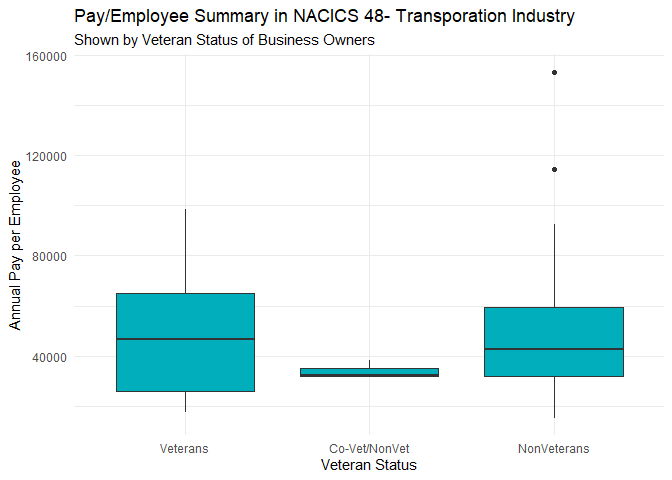

Census Bureau ABS API Vignette
================
Lisa O’Connell
2023-10-10

## Introduction

Data from the American Business Survey (ABS) conducted by the US Census
Bureau is explored in this vignette. The purpose of the vignette is to
demonstrate access to multiple endpoints within the ABS data using a
several query parameters. Additionally an Exploratory Data Analysis
(EDA) is completed which includes both numeric and graphical
summarizations. This vignette was created and is shared using a GitHub
repository and GitHub page.

## Description of Data

**Endpoints Over Time**  
The American Business Survey data represents aggregated responses from
the ABS survey conducted in the prescribed year from the selected
endpoint. The purpose of the ABS surveys are to provide a profile of
businesses in America, with responses tabulated across several
classification categories.

The ABS data accessed for this vignette represents the endpoints for the
year 2021 which contains data from the 2020 survey. Data from survey
estimates for the years 2020-2018 are available.

*Endpoint Pathways:*  
CS Data: - Company Summaries: <http://api.census.gov/data/2020/abscs>  
CB <Data:-> Characteristics of Business:
<https://api.census.gov/data/2020/abscb>

*Additional Endpoints Available*  
An additional endpoint is available, but is not used in this vignette:  
- Characteristics of Business Owners:
<https://api.census.gov/data/2020/abscbo>  
- Module Business Characteristics:
<https://api.census.gov/data/2020/absmcb>

The ABS datasets contain summarized survey data from 2021 survey
estimates. Data is available at the US, state and statistical area
levels. This vignette accesses data at the US level.

Business data can be profiled using survey responses classifications
related to the business owner including for example veteran stats, sex,
& race.

Quantitative variables the endpoints accessed in this vignette include
estimated number of employees, a count of responding firms and estimated
annual payroll expenses.

**Returned Data Format:**  
As described in the [“CENSUS Data API User
Guide”](https://www.census.gov/content/dam/Census/data/developers/api-user-guide/api-guide.pdf)
The American Business Survey data is returned through an API via a 2
dimensional JSON array formatted as shown below for 3 variables:

\[\[“EMP” ,“STATE”, “PAYANN”\]\],  
\[“10000,”GA”, “500000”\],  
\[“5000,”TX”, “650000”\]….

As a result, a general function has not used to query all
classifications in one data pull. More sophisticated programming
techniques may be able to improve the data access functions, improving
the efficiency and streamlining this code.

The ABS endpoints include records at various levels of aggregation.

The ABS data use the North American Industry Code System (NAICS2017)
values, with aggregations of data at the 4-digit, 3-digit, and 2 digit
NAICS code.

# Requirements: R Libraries

The following libraries are used to process access and process data in
R. The `tidyverse` library provides a set of packages relevant for data
tidying, wrangling, and data summarization. The `httr` package provides
functions for manipulating urls. The `jsonlite`package provides
functions transfer of json data. The `pollster` package was included to
faciliate cross tab summarizations of aggregated survey data. Finally,
the `gghalves` package was included to create addtional graphing styles.
Select functions from `knitr` are used to create table output.

`library(tidyverse)` `library(httr)` `library(jsonlite)` \#pollster
library added to handle aggregated data `library(pollster)` \#gghalves
for additional plotting `library(gghalves)`

# Functions to Retrieve ABS Data

Several functions are created to facilitate data retrieval. These
functions allow query arguments to be passed in to select specific
results. Several helper functions are created to support the data
wrangling and cleaning process.

Wrapper functions are created to tidy data once received from the API
call.

# Functions List

API Path Functions:  
**CS_Data**  
`CSData` - A combined function to create an API path, wrangles data into
tidy tibble. Arguments allow for modification of 2 values in the
endpoint (veteran status and industry code), with a default of a
wildcard to allow it to be used as needed.

**CB Data**  
`CB_Path` - Creates query path. Four user query parameters are allowed -
NCAICS code, Survey Question, Veteran Status, and Owner Sex. `CB_Data` -
Retreives data from the Characteristics of Businesses endpoint.

*Common Helper Functions*  
`ConvertData`  
`CreateTibble`  
`Wrangle`  
`DeAgto4`  
Additionally, a there are helper functions to modify the unique
variables passed into each of the above functions to implicitly coerice
variable types and create factors.

## Query parameters:

**NAICS2017** The NAICS industry code is the primary subsetting variable
for both datasets. It is from the 2017 NAICS table. The arguement for
this queray parameter is labeled `industryCode=`. This value can take on
any 2-4 digit representation of the NAICS table, using a “\*” as a
wildcard.

**VET_GROUP** A categorical variable that returns the status of the
business owner as a veteran. The query parameter for this function
arguement is `vetStatus=`, and cand take on the value, of vet, nonvet,
both, all or a wildcard.

**SEX** - A categorical variable returning the sex of the business
owner. This arguement is labeled `sex=` and can take on the value of
male, female or all.

**Survey Questions** Survey responses are captured in the survey
questions variables. There are several survey questions to choose from,
so it is impractical for this vignette to code user friendly
descriptions for all survey questions. A table of the survey question
codes and the answer codes can be found on the ABS website here:
<https://www.census.gov/data/developers/data-sets/abs.html>.

This vignette focuses on survey question “B02” related to businesses
being either family run or not family operated. The aruguement for this
survey question is `bizAttrib="B02"`.

## Function Definitions

**User friendly inputs for functions:**  
The following words are used as input to the functions.

`vetstatus = "all"` both non vet and vet business owners  
`vetstatus = "vet"` vet business owners  
`vetStatus = "both"` equally vet/nonvet ownership  
`vetstatus = "none"` non vet

`sex=all` male, female and equal shared ownership  
`sex=female`female owners only  
`sex=male`male owners only

*The user of these functions must know their industry code of interest
and survey question of interest.*

``` r
CSData<- function(vetStatus="all",industryCode="*") {
#* is a wildcard value

endpath <- "https://api.census.gov/data/2020/abscs?"

#A list of variable to return, excluding the query variables
varlist <- "get=FIRMPDEMP,PAYANN,EMP,RCPPDEMP,SECTOR,SUBSECTOR"

#Parse the user-friendly inputs

 switch(vetStatus, 
       vet = {vtStat<-"002"},
       nonvet = {vtStat<- "004"},
       mixed = {vtStat<- "003"},
       all = {vtStat<- "002&VET_GROUP=004&VET_GROUP=003"} )

#Paste query variables to path
path <- paste0(endpath,
              varlist,
              #A list of  query arguments
              "&for=us:*",
              "&NAICS2017=", industryCode,
              "&VET_GROUP=", vtStat, 
              "&key=324a30368aa24fca02eb737c15d7c32c63c891cb")

#Execute the API call 
raw_data <- GET(path)

#Print status code of returned data
a<-status_code(raw_data)
print(a)

my_df<-raw_data %>%
     Wrangle() %>% # A wrapper function
     #Modify variable types
     mutate(Firms = as.double(FIRMPDEMP),
            Revenue = as.double(RCPPDEMP),
            Payroll = as.double(PAYANN),
            Employees = as.double(EMP)) %>% 
     mutate(Industry = as.factor(NAICS2017), 
             SECTOR=as.factor(SECTOR), 
             SUBSECTOR= as.factor(SUBSECTOR),
             VET_GROUP= as.factor(VET_GROUP))
return(my_df)
}
```

``` r
ConvertData<-function (myraw) {
  a1<-fromJSON(rawToChar(myraw$content))
  a2<-as_tibble(a1)
  invisible(a2)
}
```

``` r
CreateTibble<-function(temp_df) {
  
#Create tibble 
temp_df<-as_tibble(temp_df)

#Get variable names from the first row of data
var_names<-slice(temp_df,1)
num_cols<-length(var_names)
  
b<-pivot_longer(var_names, 
                cols=1:num_cols,
                values_to = "new_name", 
                names_to="old_name")

#Replace variable names
my_names<-b$new_name

#Remove the column name header row
colnames(temp_df)<-my_names
new_data<-temp_df[-1, ]
  
#Return data in pipe form
invisible(new_data)
}
```

``` r
Wrangle<- function(my_df){
  number_vars<-c("PAYANN", "FIRMPDEMP",  "EMP")     

    tidy_data <- my_df %>% 
       ConvertData() %>% 
       CreateTibble() %>% 
       DeAgto4() %>% 
       mutate(across(number_vars, as.double)) 
   invisible(tidy_data)
}
```

``` r
#Removes aggregated records to leave only 4 digit NAICS codes.
#This is needed to remove duplicate rows reported in the raw data due to aggregation values
DeAgto4<-function (a_df) {

    a <- a_df %>%
        filter(((nchar(NAICS2017)) > 3) &
               ((substring(NAICS2017, 3,3)!="-")))
    invisible (a)
    }
```

``` r
CB_Path<- function(bizAttrib="B02", bizAnswer="*", vets="all", industryCode="*", sx="all") {

# For purpose of this demonstration, a default question is set for bizAttrib.


  endpath <- "https://api.census.gov/data/2020/abscb?"
  varlist <- "get=QDESC_LABEL,BUSCHAR_LABEL,EMP,FIRMPDEMP,PAYANN,RCPPDEMP,SECTOR,SUBSECTOR"

   switch(vets, 
       vet = {vtStat<-"002"},
       nonvet = {vtStat<- "004"},
       mixed = {vtStat<- "003"},
       all = {vtStat<- "002&VET_GROUP=004&VET_GROUP=003"})
     
   switch(sx, 
      all = {SEX <- "002&SEX=003&SEX=004"},
      male = {SEX <-"003"},
      female = {SEX<- "002"} )

  path <- paste0(endpath,varlist,
                "&for=us:*",
                "&NAICS2017=", industryCode,
                "&VET_GROUP=",vtStat,
                "&SEX=", SEX,
                "&QDESC=",bizAttrib,
                "&BUSCHAR=", bizAnswer,
                "&key=324a30368aa24fca02eb737c15d7c32c63c891cb")

}
```

``` r
CB_Data<- function (path) {

  rawcb <- GET(path)
   
#Print status code of returned data
   a<-status_code(rawcb)
   print(a)
  
#Tidy data
 
   my_df<-rawcb %>%
      Wrangle() %>%
       DeAgto4() %>% 
   #Modify variable types
   mutate(Firms = as.double(FIRMPDEMP),
            Revenue = as.double(RCPPDEMP),
            Payroll = as.double(PAYANN),
            Employees = as.double(EMP))     %>% 
     mutate(Industry = as.factor(NAICS2017), 
             SECTOR=as.factor(SECTOR), 
             SUBSECTOR= as.factor(SUBSECTOR),
             SEX= as.factor(SEX),
             BUSCHAR= as.factor(BUSCHAR),
             VET_GROUP= as.factor(VET_GROUP))
invisible(my_df)
  }
```

## Exploring the Company Summary Data

### RQ1 - A Review of Veteran Owned Businesses

The Company Summary endpoints allows us to profile businesses and
business owners.  
I have chosen to access the endpoint to review business ownership by
veterans across all industry secotrs.

Let’s get some data using my API functions:

``` r
#This represent 1 modification of the CS endpoint, extracting by Vet status
CS_AllVets<-CSData(vetStatus = "all", industryCode = "*")
```

    ## [1] 200

``` r
#Return Status of API pull displayed
```

Lets look at the nature of the variables stored in the dataset, using
the 5 number summaries for quantitative values.

``` r
summary(CS_AllVets)
```

    ##    FIRMPDEMP            PAYANN         
    ##  Min.   :     0.0   Min.   :        0  
    ##  1st Qu.:     0.0   1st Qu.:        0  
    ##  Median :   102.5   Median :   101250  
    ##  Mean   :  6627.0   Mean   :  3466582  
    ##  3rd Qu.:  2281.5   3rd Qu.:  1654831  
    ##  Max.   :396226.0   Max.   :136308343  
    ##                                        
    ##       EMP            RCPPDEMP        
    ##  Min.   :      0   Length:822        
    ##  1st Qu.:      0   Class :character  
    ##  Median :   2100   Mode  :character  
    ##  Mean   :  75397                     
    ##  3rd Qu.:  35186                     
    ##  Max.   :8268436                     
    ##                                      
    ##      SECTOR      SUBSECTOR    NAICS2017        
    ##  31     :253   311    : 27   Length:822        
    ##  44     : 79   332    : 27   Class :character  
    ##  48     : 77   423    : 27   Mode  :character  
    ##  42     : 57   424    : 27                     
    ##  62     : 52   541    : 27                     
    ##  56     : 33   561    : 24                     
    ##  (Other):271   (Other):663                     
    ##  VET_GROUP      us           
    ##  002:277   Length:822        
    ##  003:264   Class :character  
    ##  004:281   Mode  :character  
    ##                              
    ##                              
    ##                              
    ##                              
    ##      Firms             Revenue 
    ##  Min.   :     0.0   Min.   :0  
    ##  1st Qu.:     0.0   1st Qu.:0  
    ##  Median :   102.5   Median :0  
    ##  Mean   :  6627.0   Mean   :0  
    ##  3rd Qu.:  2281.5   3rd Qu.:0  
    ##  Max.   :396226.0   Max.   :0  
    ##                                
    ##     Payroll            Employees      
    ##  Min.   :        0   Min.   :      0  
    ##  1st Qu.:        0   1st Qu.:      0  
    ##  Median :   101250   Median :   2100  
    ##  Mean   :  3466582   Mean   :  75397  
    ##  3rd Qu.:  1654831   3rd Qu.:  35186  
    ##  Max.   :136308343   Max.   :8268436  
    ##                                       
    ##     Industry  
    ##  1131   :  3  
    ##  1132   :  3  
    ##  1133   :  3  
    ##  1142   :  3  
    ##  1151   :  3  
    ##  1152   :  3  
    ##  (Other):804

To explore teh overall presence of veteran owned firms across

``` r
#Create summarized dataset 
BySector<-CS_AllVets %>%
   group_by(SECTOR,VET_GROUP) %>% 
   summarize(Firms = sum(Firms))
```

    ## `summarise()` has grouped output by 'SECTOR'.
    ## You can override using the `.groups` argument.

``` r
#Plot of veterans by sector

ggplot(BySector,aes(SECTOR, Firms)) +
  geom_col(fill= "#00AFBB")+
  theme_light()+
  labs(title="Count of Firms by NAICS Industry Sector",
       subtitle = "By Owner Veteran Status, 2=Veterans, 4=NonVeterans, 3=Joint =Ownership") +
   facet_wrap(~VET_GROUP)
```

<!-- -->

The count of firms owned by veterans is quite small across all American
Business.

As the plot above shows, there are large concentrations of veterans in
sector 23(Construction), 54(Scientific & Technincal Services), and 62
(Healthcare). Of course this is consistent with the overall size of the
these sectors.

## RQ2: An Exloration of the Transporation Industry - NAICS Sector 48

Logistics and Transportation (Sector 48) is a growing area, and with
that I was interesting in taking a look at this sector more closely.
First, let’s pull some data using the \`industryCode argument. The
wildcard default is used for the veteran code.

``` r
CS_48<-CSData(industryCode = "48*")
```

    ## [1] 200

``` r
#A succesful data pull returns a code of 200
```

Now that we havewrangled and cleaned data, lets look at some numeric
summaries using our veteran classification within the returned data.
This time we will lookat the industries that make up the larger
transporation sector. Subsectors are presented by 3 digit NAICS codes.

First we will look at total firms, then total employees. As expected
these distributions mirror one another. Subsectors 488, Truck
Transportation, and Subsector 485 stands out for further
investigation.This is the sector for Urban Transit and Ground
Transportation.

``` r
#Count firms
CS_SubSectors<-CS_48 %>%      
    group_by(SUBSECTOR,VET_GROUP) %>% 
     summarize(TotFirms = sum(Firms))
```

    ## `summarise()` has grouped output by
    ## 'SUBSECTOR'. You can override using the
    ## `.groups` argument.

``` r
#Show the distribution of business owners by veteran status

CS_SubSectorEmps<-CS_48 %>%      
    group_by(SUBSECTOR,VET_GROUP) %>% 
     summarize(TotEmps = sum(Employees))
```

    ## `summarise()` has grouped output by
    ## 'SUBSECTOR'. You can override using the
    ## `.groups` argument.

``` r
#Plot Firms
ggplot(CS_SubSectors, aes(SUBSECTOR,TotFirms,fill=VET_GROUP))+
  geom_col()+
     labs(title="Total Firms by Veteran Classification in Transporation Sector",
         x= "Industry NAICS Sector 2017",
         y= ("Number of Firms")) +
         scale_fill_discrete(name="Veteran Status",
                             labels=c("Veterans", "Vet/NonVet Partners", "NonVeterans"))+
      theme_minimal()
```

<!-- -->

``` r
#Plot Employees
  ggplot(CS_SubSectorEmps, aes(SUBSECTOR,TotEmps,fill=VET_GROUP))+
  geom_col()+
     labs(title="Total Employees by Veteran Classification in Transporation Sector",
         x= "Industry NAICS Sector 2017",
         y= ("Number of Employees")) +
         scale_fill_discrete(name="Veteran Status",
                             labels=c("Veterans", "Vet/NonVet Partners", "NonVeterans"))+
      theme_minimal()
```

<!-- -->

Since the ABS data is aggregated, I have used both dplyr functions and
alternatively functions from pollster to help create cross-tab tables.

Let’s look at those summaries of the number of firms owned by Veterans
vs non by Sectors using crosstabs:

``` r
a<-CS_48 %>% 
   group_by(SUBSECTOR,VET_GROUP) %>% 
   summarize(nFirms=sum(Firms)) %>% 
   spread(VET_GROUP,nFirms,sep="_") %>% 
   rename(NonVets= "VET_GROUP_002", "Vet/NonVet_Owners"= "VET_GROUP_003", "VETs" = "VET_GROUP_004") 
```

    ## `summarise()` has grouped output by
    ## 'SUBSECTOR'. You can override using the
    ## `.groups` argument.

``` r
#Print the table

knitr::kable(a,caption="Crosstab Count of Firms by Veteran Status in Sector 48")
```

| SUBSECTOR | NonVets | Vet/NonVet_Owners |   VETs |
|:----------|--------:|------------------:|-------:|
| 481       |       0 |                 0 |   1568 |
| 483       |      19 |                 0 |    203 |
| 484       |    6827 |              1346 | 115037 |
| 485       |     613 |                 6 |  13811 |
| 486       |       2 |                NA |     60 |
| 487       |     238 |                 8 |   2404 |
| 488       |    1419 |                 0 |  31728 |

Crosstab Count of Firms by Veteran Status in Sector 48

I decided to look at the pay rates within the transportation industry.
We can look to see if payrates appear visually different to guide a
deeper analysis. For this analysis, I will use the data for all vet
owners.

``` r
#Using 4 digit codes
pay_df2<-CS_48 %>%
    mutate(AvgAnnualPay= (Payroll*1000)/Employees) %>% 
    filter(AvgAnnualPay!="NaN" & SUBSECTOR!="NA") 
 
ggplot(pay_df2,aes(x=VET_GROUP,y=AvgAnnualPay)) +
     geom_boxplot(fill="#00AFBB")+
      theme_minimal()+
      labs(title="Mean and Spread of Average Annual Pay in NACICS 48- Transporation Industry", 
           subtitle= "Shown by Businesses Owner Veteran Status",
            x="Veteran Status",
            y="Average Annual Pay") +
       scale_x_discrete(labels=(c("Veterans", "Co-Vet/NonVet", "NonVeterans")))
```

<!-- -->

As the chart shows, the mean annual pay based on the data from 4-digit
codes for all transportation businesses appears higher for veterans.
This would suggest further investigation to the make of of the business
in the individual 4 digit sectors to see if there are differences that
is driving this result.

## RQ3 Exploration of Characteristics of Business (CB) Owners Data

The CB dataset allows us to better understand key attributes of business
owners, for example whether businesses are family owned or franchised.
These can be accessed by querying the specific survey question and their
corresponding answers. Given the structure of the dataset, it is
necessary to know the survey question number to access this information.
My focus will be on family business characteristics which are captured
in the ABS survey question labeled **“B02”**.

To explore family business ownership, I started by looking at the number
of firms owned by families across industry sectors to see if some
sectors have higher percentage of family businesses.

First we must pull data from teh CB endpoint. I will use the wildcard \*
input for the NAICS code, and retrieve data survey results from question
B02.

``` r
familypath<-CB_Path(bizAttrib = "B02" )
fambiz<-CB_Data(familypath)
```

    ## [1] 200

``` r
#A code of 200 is returned if data is retreived,
```

As the cross tablulation below shows, family owned businesses as a share
of total sector business owners are highest in the NAICS sector 22
(accounting for 62% of owners, although the number of firms here is
small), Sector 44, a much larger sector where family owners represent
36% or over 87,000 firms. Similar high numbers of firms are in sectors,
53, and 56.

``` r
fambiz2<- fambiz %>% 
       #Remove summary rows from aggregated data         
       filter(BUSCHAR %in% c("BM","BN")) 

t1<- pollster::crosstab(fambiz2, y=BUSCHAR_LABEL, x=SECTOR,weight=FIRMPDEMP)
knitr::kable(t1,caption = "Crosstab Summary of Percent Split of Family Owned Businesses by Sector")
```

| SECTOR | Family-owned | Not family-owned |      n |
|-------:|-------------:|-----------------:|-------:|
|     11 |   42.3963852 |         57.60361 |   6418 |
|     21 |   28.2418650 |         71.75813 |   4118 |
|     22 |    0.6134969 |         99.38650 |    163 |
|     23 |   29.8259645 |         70.17404 | 302582 |
|     31 |   33.9945315 |         66.00547 |  58883 |
|     42 |   26.8708870 |         73.12911 |  90719 |
|     44 |   34.7060245 |         65.29398 | 215222 |
|     48 |   27.0095827 |         72.99042 |  55621 |
|     51 |   19.7904178 |         80.20958 |  22521 |
|     52 |   17.0172027 |         82.98280 | 100798 |
|     53 |   28.3094138 |         71.69059 | 123330 |
|     54 |   17.7173894 |         82.28261 | 397869 |
|     55 |    0.0000000 |        100.00000 |   1971 |
|     56 |   27.1314821 |         72.86852 | 139152 |
|     61 |   25.1391422 |         74.86086 |  21381 |
|     62 |   13.1426177 |         86.85738 | 276817 |
|     71 |   26.7089788 |         73.29102 |  43959 |
|     72 |   35.0976458 |         64.90235 | 182394 |
|     81 |   31.3932887 |         68.60671 | 150701 |

Crosstab Summary of Percent Split of Family Owned Businesses by Sector

To see the distribution of actual counts of firms by sector the
following tables are produced:

``` r
#For Family Owned Businesses:
 BM<-fambiz2 %>% filter(BUSCHAR == "BM")
 BN<-fambiz2 %>% filter(BUSCHAR == "BN")
# 
#Use pollster function to display crosstables
#For Family Owned Businesses:
t2<-pollster::topline(BM, variable =SECTOR,weight=FIRMPDEMP, valid_pct = FALSE,cum_pct = FALSE)
knitr::kable(t2, caption ="Count of Family Owned Businesses by Sector")
```

| Response | Frequency |    Percent |
|:---------|----------:|-----------:|
| 11       |      2721 |  0.4877760 |
| 21       |      1163 |  0.2084835 |
| 22       |         1 |  0.0001793 |
| 23       |     90248 | 16.1781736 |
| 31       |     20017 |  3.5883178 |
| 42       |     24377 |  4.3699067 |
| 44       |     74695 | 13.3900882 |
| 48       |     15023 |  2.6930758 |
| 51       |      4457 |  0.7989775 |
| 52       |     17153 |  3.0749071 |
| 53       |     34914 |  6.2588063 |
| 54       |     70492 | 12.6366436 |
| 55       |         0 |  0.0000000 |
| 56       |     37754 |  6.7679147 |
| 61       |      5375 |  0.9635414 |
| 62       |     36381 |  6.5217859 |
| 71       |     11741 |  2.1047329 |
| 72       |     64016 | 11.4757331 |
| 81       |     47310 |  8.4809568 |

Count of Family Owned Businesses by Sector

``` r
# #For Non-Family Owned Businesses
t3<-pollster::topline(BN, variable =SECTOR,weight=FIRMPDEMP, valid_pct = FALSE,cum_pct = FALSE)
knitr::kable(t3, caption ="Count NonFamlily Owned Businesses by Sector")
```

| Response | Frequency |    Percent |
|:---------|----------:|-----------:|
| 11       |      3697 |  0.2258702 |
| 21       |      2955 |  0.1805373 |
| 22       |       162 |  0.0098975 |
| 23       |    212334 | 12.9726579 |
| 31       |     38866 |  2.3745388 |
| 42       |     66342 |  4.0531995 |
| 44       |    140527 |  8.5855713 |
| 48       |     40598 |  2.4803563 |
| 51       |     18064 |  1.1036296 |
| 52       |     83645 |  5.1103355 |
| 53       |     88416 |  5.4018222 |
| 54       |    327377 | 20.0012708 |
| 55       |      1971 |  0.1204193 |
| 56       |    101398 |  6.1949644 |
| 61       |     16006 |  0.9778950 |
| 62       |    240436 | 14.6895645 |
| 71       |     32218 |  1.9683757 |
| 72       |    118378 |  7.2323665 |
| 81       |    103391 |  6.3167278 |

Count NonFamlily Owned Businesses by Sector

**Family Business by Sex**  
To allow for another look at the data, we are able to split the data
further by sex, to see if there are notable differences overall in the
number of family owned businesses by owner sex.

Lets explore the number of family owned vs non-family owned businesses
by owner sex (as defined as male, female, or equally share of owndership
(male and female).

``` r
# #Display Crosstab
ft1<-pollster::crosstab(fambiz2, y=SEX, x=SECTOR,weight=FIRMPDEMP)
ft1<-ft1 %>% rename("Females"="002", "Males"= "004", "Mixed"="003")

knitr::kable(ft1,caption="Overall split of Family Owned Businesses by Sex" )
```

| SECTOR |   Females |     Mixed |     Males |      n |
|-------:|----------:|----------:|----------:|-------:|
|     11 | 16.718604 |  65.11374 | 18.167654 |   6418 |
|     21 |  6.192326 |  76.83341 | 16.974259 |   4118 |
|     22 | 11.656442 |  88.34356 |  0.000000 |    163 |
|     23 |  8.879246 |  78.20558 | 12.915177 | 302582 |
|     31 | 13.830817 |  74.74144 | 11.427746 |  58883 |
|     42 | 11.714194 |  81.18255 |  7.103253 |  90719 |
|     44 | 23.354025 |  59.91720 | 16.728773 | 215222 |
|     48 | 11.603531 |  75.99827 | 12.398195 |  55621 |
|     51 | 15.181386 |  75.69824 |  9.120377 |  22521 |
|     52 | 18.677950 |  74.91220 |  6.409849 | 100798 |
|     53 | 26.135571 |  56.88235 | 16.982081 | 123330 |
|     54 | 25.906266 |  64.80500 |  9.288736 | 397869 |
|     55 |  0.000000 | 100.00000 |  0.000000 |   1971 |
|     56 | 21.744567 |  63.98758 | 14.267851 | 139152 |
|     61 | 46.092325 |  40.63889 | 13.268790 |  21381 |
|     62 | 36.690666 |  54.68956 |  8.619774 | 276817 |
|     71 | 24.384085 |  59.04593 | 16.569986 |  43959 |
|     72 | 22.126276 |  58.20148 | 19.672248 | 182394 |
|     81 | 29.510753 |  52.82579 | 17.663453 | 150701 |

Overall split of Family Owned Businesses by Sex

``` r
#Since we have aggregated data and some geoms do not allow 
#for stat=identity parameters,I unwieght the aggregated
#data for the geom_count plot. 

b<-fambiz2%>% 
 uncount(weights=.$Firms)

#Plot the difference in the number of firms owned by sex
ggplot(b,aes(SEX,SECTOR)) +
  geom_count(color="magenta") +
  labs(title= "Family Business Ownership by Sector & Owner Sex",
       subtitle = "Dot Size Represents Relative # Firms",
       x= "Owner Sex",
       y= "Sector")+
    scale_x_discrete(labels=(c("Female", "Male", "Joint Owned Male/Female"))) +
    theme_light()
```

<!-- --> Let’s look
at some cross tab tables:

``` r
fam3<-fambiz2 %>%
    select(SECTOR,SUBSECTOR, FIRMPDEMP,EMP,BUSCHAR, everything()) %>%
     group_by(SECTOR,SEX,BUSCHAR) %>%
    summarize(Firms = sum(FIRMPDEMP))
```

    ## `summarise()` has grouped output by 'SECTOR',
    ## 'SEX'. You can override using the `.groups`
    ## argument.

``` r
#Tables
#
t6<-pollster::crosstab_3way(fam3, y=BUSCHAR, x=SECTOR,z=SEX, weight=Firms, format = "wide")
t6<-t6 %>% rename("Family Firms"="BM", "NonFamilyFirms" = "BN")
knitr::kable(t6, caption = "Split of Firms by Sector, Sex and Business Classification")
```

| SECTOR | SEX | Family Firms | NonFamilyFirms |      n |
|:-------|----:|-------------:|---------------:|-------:|
| 11     |   2 |   14.9114632 |      85.088537 |   1073 |
| 11     |   3 |   33.3811917 |      66.618808 |   4179 |
| 11     |   4 |  100.0000000 |       0.000000 |   1166 |
| 21     |   2 |   26.2745098 |      73.725490 |    255 |
| 21     |   3 |   12.5474083 |      87.452592 |   3164 |
| 21     |   4 |  100.0000000 |       0.000000 |    699 |
| 22     |   2 |    0.0000000 |     100.000000 |     19 |
| 22     |   3 |    0.6944444 |      99.305556 |    144 |
| 22     |   4 |          NaN |            NaN |      0 |
| 23     |   2 |   50.4485056 |      49.551494 |  26867 |
| 23     |   3 |   16.7628763 |      83.237124 | 236636 |
| 23     |   4 |   94.7490980 |       5.250902 |  39079 |
| 31     |   2 |   40.9135560 |      59.086444 |   8144 |
| 31     |   3 |   22.9606908 |      77.039309 |  44010 |
| 31     |   4 |   97.7857037 |       2.214296 |   6729 |
| 42     |   2 |   33.0855368 |      66.914463 |  10627 |
| 42     |   3 |   19.5755486 |      80.424451 |  73648 |
| 42     |   4 |  100.0000000 |       0.000000 |   6444 |
| 44     |   2 |   26.0370451 |      73.962955 |  50263 |
| 44     |   3 |   22.1348532 |      77.865147 | 128955 |
| 44     |   4 |   91.8342406 |       8.165759 |  36004 |
| 48     |   2 |   28.6643942 |      71.335606 |   6454 |
| 48     |   3 |   14.8494240 |      85.150576 |  42271 |
| 48     |   4 |  100.0000000 |       0.000000 |   6896 |
| 51     |   2 |   18.6311787 |      81.368821 |   3419 |
| 51     |   3 |   11.0042234 |      88.995777 |  17048 |
| 51     |   4 |   94.6445959 |       5.355404 |   2054 |
| 52     |   2 |   13.2203750 |      86.779625 |  18827 |
| 52     |   3 |   11.5521123 |      88.447888 |  75510 |
| 52     |   4 |   91.9517103 |       8.048290 |   6461 |
| 53     |   2 |   13.2566004 |      86.743400 |  32233 |
| 53     |   3 |   16.5823272 |      83.417673 |  70153 |
| 53     |   4 |   90.7563025 |       9.243697 |  20944 |
| 54     |   2 |   14.8050411 |      85.194959 | 103073 |
| 54     |   3 |    8.8966370 |      91.103363 | 257839 |
| 54     |   4 |   87.3799280 |      12.620072 |  36957 |
| 55     |   2 |          NaN |            NaN |      0 |
| 55     |   3 |    0.0000000 |     100.000000 |   1971 |
| 55     |   4 |          NaN |            NaN |      0 |
| 56     |   2 |   18.8611276 |      81.138872 |  30258 |
| 56     |   3 |   14.9853998 |      85.014600 |  89040 |
| 56     |   4 |   94.2077163 |       5.792284 |  19854 |
| 61     |   2 |   13.5667174 |      86.433283 |   9855 |
| 61     |   3 |   13.8220739 |      86.177926 |   8689 |
| 61     |   4 |  100.0000000 |       0.000000 |   2837 |
| 62     |   2 |    8.1355966 |      91.864403 | 101566 |
| 62     |   3 |    5.4917762 |      94.508224 | 151390 |
| 62     |   4 |   82.9973597 |      17.002640 |  23861 |
| 71     |   2 |   15.2346301 |      84.765370 |  10719 |
| 71     |   3 |   12.9180151 |      87.081985 |  25956 |
| 71     |   4 |   92.7375069 |       7.262493 |   7284 |
| 72     |   2 |   26.7413336 |      73.258666 |  40357 |
| 72     |   3 |   22.0505671 |      77.949433 | 106156 |
| 72     |   4 |   83.0969037 |      16.903096 |  35881 |
| 81     |   2 |   16.0007195 |      83.999280 |  44473 |
| 81     |   3 |   20.1032547 |      79.896745 |  79609 |
| 81     |   4 |   90.8749390 |       9.125061 |  26619 |

Split of Firms by Sector, Sex and Business Classification

**Transporation and Family Owned Businesses** Let’s go back to the
transportation sector and evaluate family owned businesses.

For demonstration purposes, lets again pull family business data down
from the CB endpoint again, this time using the veteran status modifier,
and industry code. We will filter the data to remove the high level
aggregation rows present in this data (e.g. stratification totals,
classifiable, unclassifiable counts)

``` r
CB_48path<-CB_Path(vets = "all", industryCode = "48*", bizAttrib = "B02")
CB_48Data<-CB_Data(CB_48path)
```

    ## [1] 200

``` r
#Filter to remove aggregation rows
CB_48Data<-CB_48Data %>% 
 filter(BUSCHAR %in% c("BM","BN")) 
```

Let’s see how veterans owners are presented across family business
classifications.Let’s summarize the frequency of ownership by Vet Status
and Family Business status.

``` r
tt<-pollster::crosstab(CB_48Data, x=BUSCHAR_LABEL, y=VET_GROUP,weight=FIRMPDEMP)

tt <- tt %>%  rename("NonVets" = "002", "Mixed Ownership" = "003", "Vets"= "002")
knitr::kable(tt, title="Crosstabulation By Business Type (Family/Not Family Owned) and Veteran Status of Owners")
```

| BUSCHAR_LABEL    |      Vets | Mixed Ownership |      004 |     n |
|:-----------------|----------:|----------------:|---------:|------:|
| Family-owned     | 0.4561236 |       2.8116277 | 96.73225 | 14689 |
| Not family-owned | 5.3809424 |       0.1757792 | 94.44328 | 38116 |

No let’s visualize graphically this stratification of the Transportation
Industry data.

``` r
# temp_df <-CB_48Data %>% 
#            group_by(BUSCHAR,VET_GROUP) %>% 
#            summarize(TotFirms = sum(FIRMPDEMP),
#                      AvgAnnPayrollinThs= sum(PAYANN),
#                      TotEmps= sum(EMP))
# 
# 
# knitr::kable(temp_df,title="Stratification of Family Businesses by Owner Veteran Status ")
# 
# 
# #Show graphically
# 
# b<-CB_48Data%>% 
#  uncount(weights=.$Firms)
# 
# ggplot(CB_48Data, aes(VET_GROUP,BUSCHAR),color="blue") +
#  geom_jitter() +
#   labs(title= "Family Business Ownership by Veteran Status",
#        subtitle = "Dots  # Firms",
#        x= "Owner Veteran Status",
#        y= "Business Type") 
#   
#   #  scale_x_discrete(labels=(c("Female", "Male", "Joint Owned Male/Female")))
# 
# 
# ggplot(CS_48Data, aes(x=BUSCHAR,y=Firms)) 
# t48g7+ geom_half_boxplot(side="l", center = TRUE, outlier.color = "blue") +
#  geom_half_point() +
#  # facet_wrap(~VET_GROUP)
#   #theme_light()
```
